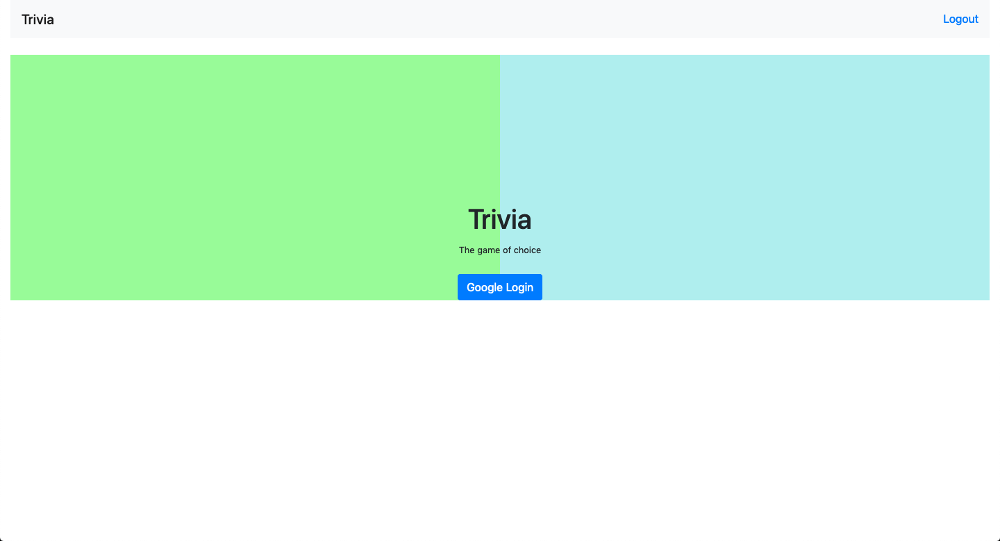
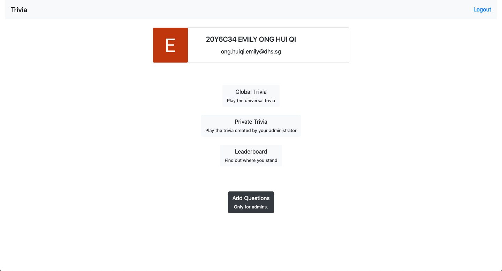
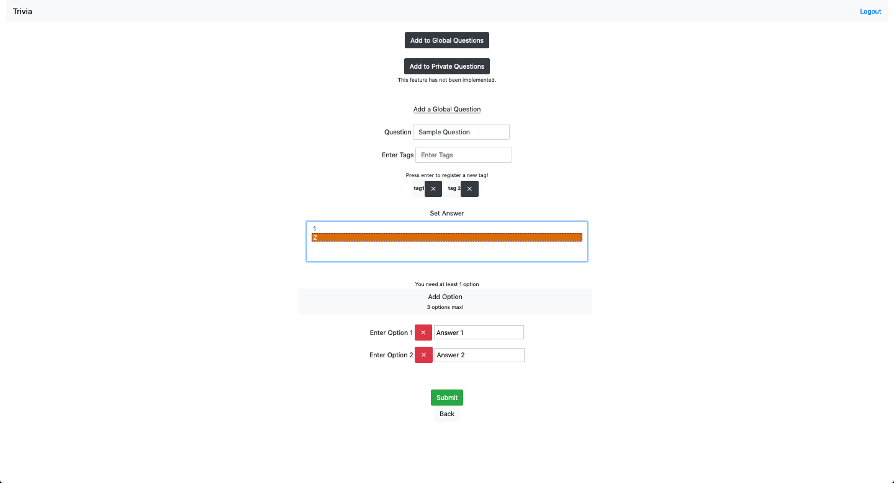
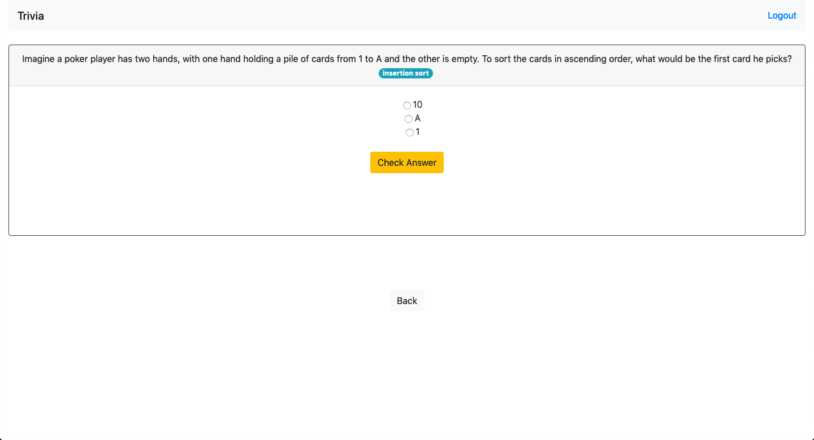
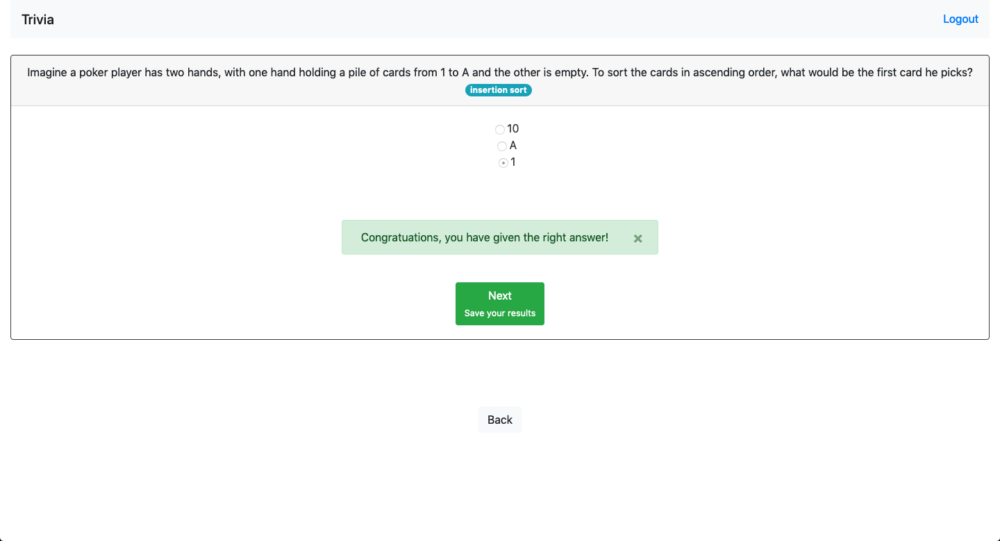
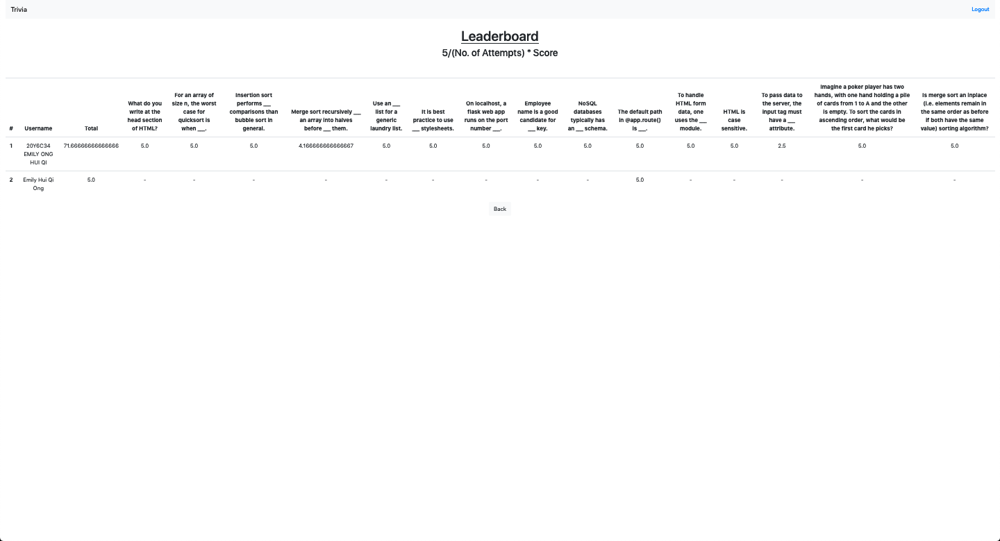

# Trivia(go)

Trivia(go) is an application that delivers questions to users to answer, where they will be able to earn points and compare with others on the leaderboard.

## DB Schema

### Admin
```sqlite3
CREATE TABLE "Admin" ( "Email" TEXT NOT NULL, PRIMARY KEY("Email") )
```

### Option
```sqlite3
CREATE TABLE "Option" ( "QuestionID" TEXT NOT NULL, "Option1" TEXT NOT NULL, "Option2" TEXT, "Option3" TEXT, "Answer" TEXT NOT NULL, PRIMARY KEY("QuestionID"), FOREIGN KEY("QuestionID") REFERENCES "Question"("QuestionID") )
```

### Question
```sqlite3
CREATE TABLE "Question" ( "QuestionID" TEXT NOT NULL, "QuestionGroup" TEXT NOT NULL, "QuestionType" TEXT NOT NULL, "QuestionText" TEXT NOT NULL, "QuestionTag" TEXT, PRIMARY KEY("QuestionID") )
```

### Score
```sqlite3
CREATE TABLE "Score" ( "UserID" TEXT NOT NULL, "QuestionID" TEXT NOT NULL, "AttemptNum" INTEGER NOT NULL, "GivenAnswer" INTEGER, FOREIGN KEY("QuestionID") REFERENCES "Question"("QuestionID"), PRIMARY KEY("QuestionID","UserID","AttemptNum"), FOREIGN KEY("UserID") REFERENCES "User"("UserID") )
```

### User
```sqlite3
CREATE TABLE "User" ( "UserID" TEXT NOT NULL, "Name" TEXT NOT NULL, "Email" TEXT NOT NULL, "ProfilePic" BLOB, "Password" TEXT, PRIMARY KEY("UserID") )
```

## Login



The login function is handled using ```Flask_Login``` as well as the Google login API. The code used for the login handling is modified from the [RealPython Tutorial](https://realpython.com/flask-google-login/).
* Google login is chosen as it provides a secure transport and makes it hard for malicious intrusion of data privacy.
* Other login API can be investigated and added, such as Facebook or Twitter.
* Might implement a raw login function based on username, email, and password for users who might not want to bind their social media accounts.

## Main page



The main page delivers a simple interface that shows the user's profile information as well as the gameplay options. Should the user be authenticated as having an administrative role, he/she will be able to add questions and the last dark button would also be shown.

### Admin



The admin can add questions to the global and private (depending if admin is authorised for the private trivia) trivia.
* Note that all gameplay/code relating to private trivia has yet to be implemented. (NOT IMPLEMENTED!)

Tags are also added as it helps to identify the category of questions which allows users to be more aware of their weaker topics.

### Game modes

1. Global
* User plays from a universal set of questions.
2. Private (NOT IMPLEMENTED!)
* User competes only with those who also have access to the private trivia. The data will not be displayed on the public leaderboard.

## Gameplay




Users will be shown a question, one at a time, followed by the options to choose from.
* This is handled using the ```localStorage``` in Javascript to continuously display questions even after the page reloads.
* The client-side Javascript code also checks for new additions to the question database as well as the current game state.
* The options and questions are also randomly shuffled so as to allow for a more genuine gameplay.

Important to implement (NOT IMPLEMENTED!): What would make the gameplay more enriching would perhaps be to add explanations for each particular question as well as generate a personal report and keep track of the user's statistics.

Such a gameplay is meant to mimic Kahoot, as displaying a long list of questions to users might be a turn-off.
* Music and timer to be added! (NOT IMPLEMENTED!)

## Leaderboard



The leaderboard only displays data that is relevant to the global trivia.
* A corresponding private leaderboard has yet to be implemented. (NOT IMPLEMENTED!)
* Perhaps I should change the formula to encourage repeated responses so that people are not discouraged by the fact that their points decrease as they play more.
